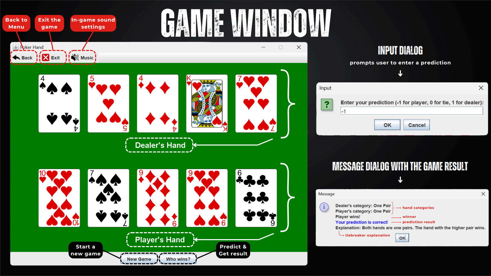
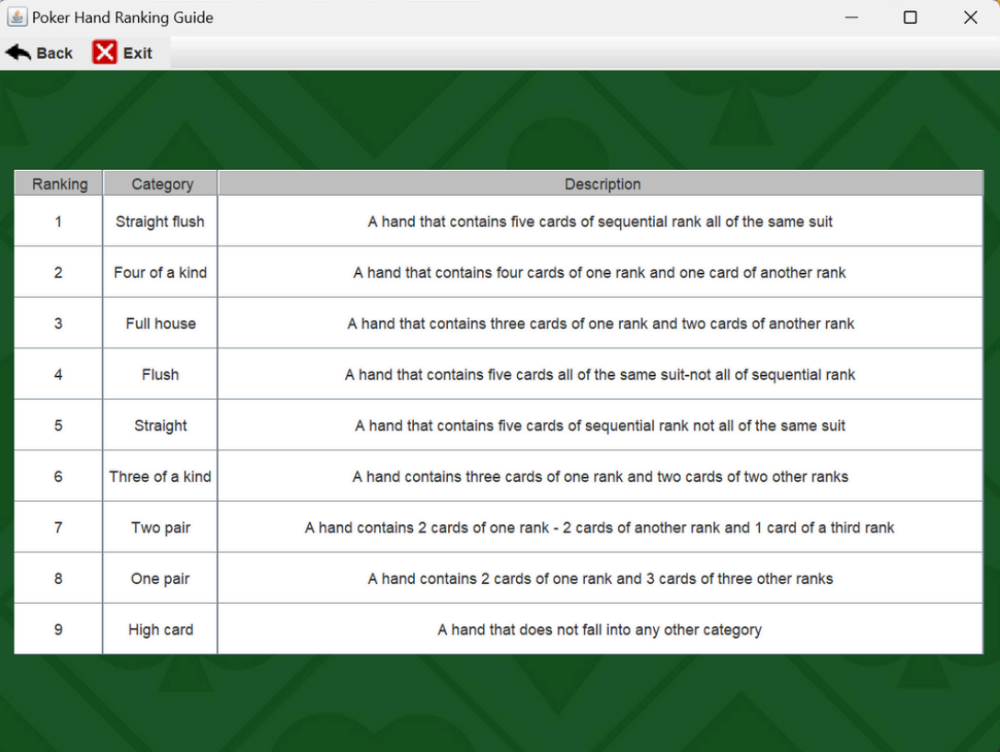
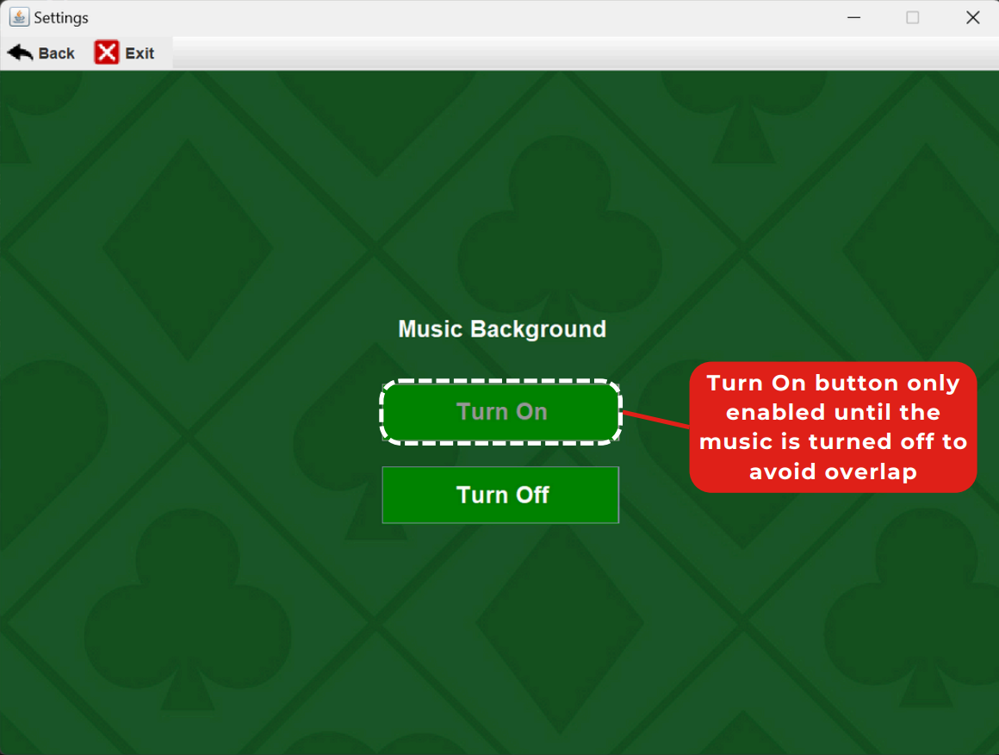
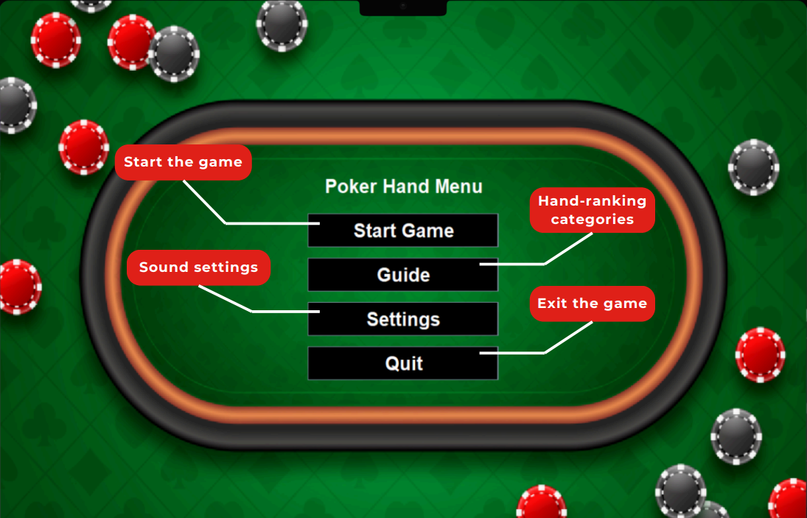

# FINAL PROJECT REPORT

## How to use the program:

### **To use the PokerHand GUI application, follow these steps:**  

1. Ensure that you have Java installed on your system. 
1. Download or clone the project repository to your local machine. 
1. Open a terminal or command prompt and navigate to the project directory. 
1. Compile all Java files using the command: **`javac \*.java`**
1. Run the App.java file using the command: **`java App`**
1. The application will launch, presenting you with the main menu screen. 
1. From the main menu, you can explore different functionalities such as starting the game, accessing the poker hand guide, adjusting settings, or quitting the application.  

By following these steps, users can interact with the PokerHand GUI Project and benefit from its educational and interactive features.  

### **I-  Introduction:** 

The  Poker  Hand  GUI  Project  is  a  comprehensive  Java  application  designed  to  provide  an interactive and educational platform for learning and practicing poker hand rankings. This project is a culmination of knowledge and techniques acquired in the Data Structures and Algorithms course, showcasing the practical application of these concepts in a user-friendly graphical interface.  

**Key objectives:**  

This project's main objective is to create a tool that facilitates understanding and comparing different poker hand categories. By combining theoretical knowledge with visual representation, users can enhance their grasp of poker hand rankings and develop strategies for effective decision- making during gameplay.  

### **II- Presentation of Code Logic and Application of Data Structures and Algorithms:**  

The Poker Hand GUI Project consists of 5 main Java files, each serving a specific purpose and utilizing various data structures and algorithms to achieve its functionality. Here's an overview of the key components and their implementation:  

1. **PokerHand\_1.java:** implements the core gameplay logic for comparing poker hands. 

Class Structure and Components: 

1. Card Class 
   - Represents a playing card with attributes for value and suit. 
   - Implements a toString() method for displaying card information 
1. Fields and Variables 

**Deck of Cards:**

You represent the deck of cards using an ArrayList of Card objects (ArrayList<Card> deck). This dynamic array allows you to easily add, remove, and shuffle cards as needed during the game. 

**Hands (Dealer's and Player's):** 

Similarly,  you  represent  the  dealer's  and  player's  hands  using  ArrayLists (ArrayList<Card>  dealerHand,  ArrayList<Card>  playerHand).  These  dynamic arrays allow for flexibility in managing the cards dealt to each player. 

**Sorting and Comparing Ranks:** 

Throughout your code, you utilize arrays (int[] ranks) to store and manipulate card ranks. For example, in methods like getRanks(),  Straight(),  FourOfAKind(), etc., you extract the ranks of cards into arrays to perform sorting and comparisons based on card values. 

**Categories of Poker Hands:** 

When evaluating the category of a poker hand (get\_category() method), you use arrays (int[] ranks) to calculate and analyze the distribution of card ranks within a hand. This allows you to determine if the hand meets the criteria for specific hand categories like One Pair, Two Pair, etc. 

3. Game Logic 
- **startGame()**: 
  - This method initializes a new game by calling buildDeck() to create a new deck of cards and shuffleDeck() to shuffle the deck. 
  - It then deals cards to the dealer and player from the shuffled deck, populating the dealerHand and playerHand ArrayLists with the appropriate cards. 
- **buildDeck()**: 
  - The buildDeck() method constructs a standard deck of 52 playing cards by iterating over predefined arrays of suits ("H" for Hearts, "D" for Diamonds, "C" for Clubs, "S" for Spades) and values ("2" to "10", "J" for Jack, "Q" for Queen, "K" for King, "A" for Ace). 
  - Each card (combination of suit and value) is created as a Card object and added to the deck ArrayList. 
- **shuffleDeck()**: 
  - The shuffleDeck() method uses Collections.shuffle() to randomize the order of cards in the deck, simulating a shuffled deck of playing cards. 
- **get\_category(ArrayList<Card> hand)**: 
- This private  method evaluates the category of a  given poker hand (passed as an ArrayList<Card>). 
- It checks the hand against various poker hand categories (e.g., Straight Flush, Four of a Kind) using helper methods like StraightFlush(), FourOfAKind(), FullHouse(), etc. 
- The method returns an integer representing the category of the hand (ranging from 1 for High Card to 9 for Straight Flush). 
- **compare\_to()**: 
- The compare\_to() method compares the categories of the dealer's hand (dealerHand) and the player's hand (playerHand) using the get\_category() method. 
- It returns an integer result based on the comparison: 
+ 1 if the dealer's hand wins. 
+ -1 if the player's hand wins. 
+ 0 if it's a tie between the hands. 
4. Event handling: 

The PokerHand\_1 class implements (ActionListener) on buttons (newGameButton, resultButton, backMenuItem, exitMenuItem, and musicButton) to handle user interactions during the game.  

- **newGameButton ActionListener**: 
- When the newGameButton is clicked, it triggers an action that calls the startGame() method to initialize a new game. 
- After initializing the game, it repaints the gamePanel to update the GUI with the new game state (new cards dealt). 
- **resultButton ActionListener**: 
  - When the resultButton is clicked, it triggers an action to determine the winner of the game. 
  - It prompts the user to enter a prediction (-1 for player, 0 for tie, 1 for dealer) using a dialog box. 
  - The method then compares the hands using compare\_to() to determine the actual winner and evaluates if the user's prediction was correct. 
  - It displays a message dialog with the game outcome (winner, prediction result, hand categories, explanation) using HTML formatting for enhanced presentation. 
- **exitMenuItem ActionListener**: 
  - The exitMenuItem allows the user to exit the application. 
- **backMenuItem ActionListener:** 
- The  backMenuItem  allows  the  user  to  navigate  back  to  the  main  menu  of  the application. 
- **musicButton ActionListener:** 
- Clicking musicButton toggles between playing and stopping the music based on its current state. 
2. **Guide.java:** provides a graphical guide to poker hand rankings 

- It uses JTable and TableModel to display the hand categories and descriptions in a tabular format. 
- The guide data is read from a CSV file using file input/output operations and data manipulation techniques. 
- Configures menu items (backMenuItem, exitMenuItem) with icons for navigation and application control.  
3. **Settings.java:** allows users to configure settings, such as enabling or disabling background music. 

- GUI Components:  Utilizes JFrame, JLabel with a background image, JButton for interactive controls, and a JMenuBar with menu items for navigation. 
- Music Control: Allows toggling of background music with the turnOn and turnOff buttons. Music playback is managed by the MusicPlayer class. 
- The MusicPlayer class, implemented as a singleton, utilizes the Java Sound API to play and control background music. 
- Event  Handling:  Implements  ActionListener  to  respond  to  button  clicks  (turnOn, turnOff, backMenuItem, exitMenuItem) 
- exitMenuItem : allows users to exit the application. 
- backMenuItem : allows users to navigate back to the main menu of the application. 
- turnOn: turn on button only enabled when the music is turn off.  
- turnOff: allows users to turn off music. 
4. **Menu.java**: 

   

- GUI Components: Utilizes JFrame to create the main menu window with a background image (JLabel) and several JButton components for interactive options. 
- Button Actions: Implements ActionListener to respond to button clicks: 
+ startButton:  When  the  startButton  is  clicked,  it  triggers  an  action  that  calls  the PokerHand\_1() method to start the game. 
+ guideButton: When the guideButton is clicked, it triggers an action that calls the Guide () method to the Guide window. 
+ settingButton: When the settingButton is clicked, it triggers an action that calls the Settings() method to the Setting window, enabling users to control music. 
+ quitButton: exit the application 
5. **MusicPlayer.java:**  provides  functionality  to  play  background  music  using  Java's javax.sound.sampled library 
- It utilizes the Java Sound API to load and play audio files. 
- The MusicPlayer class is implemented as a singleton to ensure that only one instance of the player is created, promoting efficient resource management.**  

